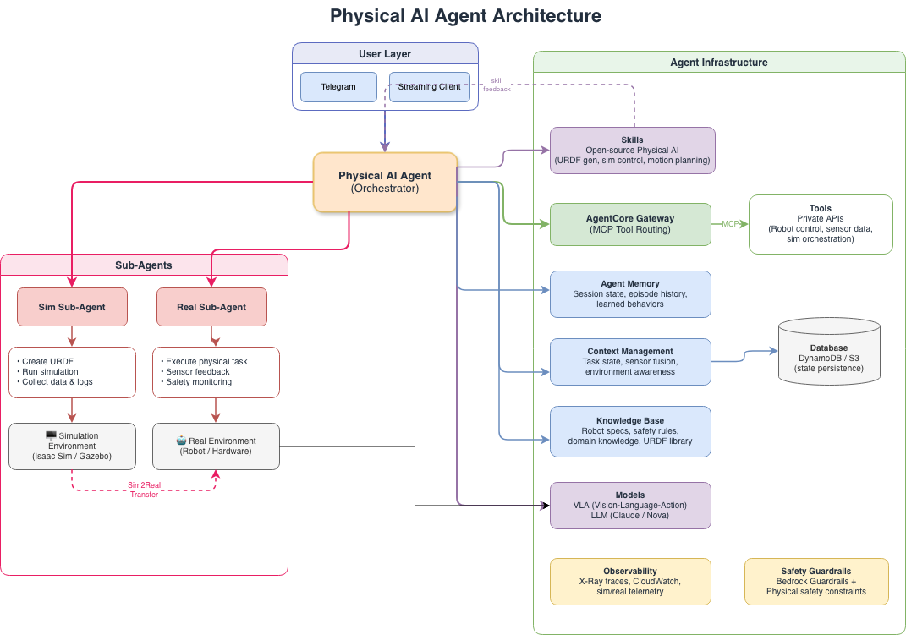

<!-- Copyright Amazon.com, Inc. or its affiliates. All Rights Reserved. -->
<!-- SPDX-License-Identifier: MIT-0 -->

# Sim2Real Robot Platform with Iterative Learning

A **robotics platform** that bridges simulation and reality through iterative learning. AI agents orchestrate NVIDIA Isaac Sim for simulation, control physical robots (SO-ARM101, XGO2, Zumi) via AWS IoT, and use **agent memory** to learn from task execution — tracking success rates, grasp accuracy, and sim-to-real transfer fidelity across iterations.

## Architecture



## Robots

| Robot | Type | Connectivity | Use Case |
|-------|------|-------------|----------|
| [SO-ARM101](models/so101/) | 6-DOF Arm | LeRobot (USB) | Pick-and-place in simulation + real |
| [XGO2](example/xgo2/) | Quadruped Dog | IoT Greengrass | Vision navigation, grip, walking |
| [Zumi](example/zumi/) | Wheeled Car | IoT Core (MQTT) | Perception, navigation, sensors |

## Agent Layer

Multiple agent backends — pick what fits your deployment:

| Agent | Interface | Best For |
|-------|-----------|----------|
| [Bedrock Converse](agent/bedrock-converse/) | Browser chat UI | IoT robot control (Zumi, XGO2) |
| [OpenClaw](agent/openclaw/) | Telegram | Isaac Sim orchestration, Sim2Real |
| [Hermes Agent](agent/hermes/) | CLI / Telegram / Discord | Self-improving skills, local models |

See [`agent/README.md`](agent/README.md) for details.

## Demo: Kitchen Orange Picking (Simulation)

SO-ARM101 picks oranges from a kitchen counter in Isaac Sim, using [LeIsaac](https://github.com/LightwheelAI/leisaac) assets.

```bash
# 1. Download scene assets
bash scripts/leisaac/download_assets.sh

# 2. Run interactive streaming
bash scripts/leisaac/run_streaming.sh

# 3. Connect: NVIDIA Streaming Client → localhost
```

See [scripts/leisaac/README.md](scripts/leisaac/README.md) for full details.

## Demo: IoT Robot Control (Physical)

Control real robots via natural language through a browser chat UI:

```bash
# 1. Provision IoT device
bash iot/provisioning/01-provision-iot-thing.sh my-zumi

# 2. Deploy device code
bash iot/provisioning/02-deploy-to-zumi.sh my-zumi

# 3. Start agent
cd agent/bedrock-converse && pip install -r requirements.txt
uvicorn app:app --reload --port 8000

# 4. Open http://localhost:8000 and chat
# "Turn on headlights", "Take a photo", "Navigate to the orange"
```

## Project Structure

```
├── agent/                     # AI agent backends
│   ├── bedrock-converse/      # AWS Bedrock multi-agent (Act, Perception, Governance)
│   ├── openclaw/              # OpenClaw agent (Telegram + Isaac Sim)
│   ├── hermes/                # Hermes Agent (self-improving loop)
│   └── aws-deployment/        # AWS deployment guide
├── scripts/
│   ├── leisaac/               # Kitchen orange picking (Isaac Sim demo)
│   ├── sim2real/              # Sim2Real memory pipeline
│   ├── telekinesis/           # Telekinesis perception-to-grasp
│   └── so101/                 # SO-101 digital twin
├── example/
│   ├── xgo2/                  # XGO2 robodog (Greengrass + vision nav)
│   └── zumi/                  # Zumi car (IoT Core + sensors)
├── iot/
│   ├── provisioning/          # IoT Thing setup scripts
│   └── greengrass/            # Greengrass deployment
├── infra/
│   └── cloudformation.yaml    # AWS memory pipeline stack
├── models/
│   └── so101/                 # SO-ARM101 URDF
├── skill/
│   ├── SKILL.md               # Isaac Sim skill
│   ├── LEISAAC_API.md         # Isaac Sim 6.0 API reference
│   ├── SIM2REAL_MCP.md        # MCP memory skill
│   ├── TELEKINESIS.md         # Telekinesis skill
│   └── IOT_CONTROL.md         # IoT robot control skill
├── docs/
│   ├── architecture.md
│   ├── iot-architecture.md    # IoT connectivity design
│   └── THREAT_MODEL.md
└── configs/
    └── docker_run.env
```

## AWS Services Used

| Service | Purpose |
|---------|---------|
| **Bedrock** | LLM reasoning + Converse API tool use + Knowledge Base (RAG) |
| **IoT Core** | MQTT device connectivity (Zumi) |
| **IoT Greengrass** | Edge ML + component deployment (XGO2) |
| **DynamoDB** | Simulation episode store |
| **OpenSearch Serverless** | Vector embeddings for RAG |
| **S3** | Knowledge docs + photo upload (presigned URLs) |
| **SageMaker Neo** | Model compilation for edge devices |

## Sim2Real Memory Pipeline

```
Isaac Sim (simulation) ──▶ DynamoDB (episodes) ──▶ Real Robot
         │                        │
         ▼                        ▼
    S3 (knowledge) ──────▶ Bedrock KB (RAG) ──────▶ MCP Server (tools)
```

**Record episodes:**
```python
from scripts.sim2real.episode_logger import EpisodeLogger
logger = EpisodeLogger()
eid = logger.start_episode(task="pick_orange_to_plate", robot_config={...})
logger.add_waypoint(1, "reach", {"shoulder_pan": -15, ...})
logger.end_episode(success=True, metrics={"time": 50.0})
```

**Transfer to real robot:**
```bash
python scripts/sim2real/bridge.py --task pick_orange_to_plate --execute
```

## Self-Improving Loop

1. **Simulate** — Run task in Isaac Sim (pick orange → place on plate)
2. **Evaluate** — Agent reviews success/failure, logs to episodic memory
3. **Adapt** — Modify strategy (grasp angle, approach vector, timing)
4. **Transfer** — Deploy refined policy to real robot via Sim2Real bridge
5. **Learn** — Real-world feedback updates agent's semantic memory

## Quick Start

### Simulation (GPU required)
```bash
# Prerequisites: Docker, NVIDIA GPU driver 550+, nvidia-container-toolkit
git clone https://github.com/aws-samples/sample-self-improving-physical-AI.git
cd sample-self-improving-physical-AI
bash scripts/leisaac/download_assets.sh
bash scripts/leisaac/run_streaming.sh
```

### Physical Robot (no GPU needed)
```bash
cd agent/bedrock-converse
pip install -r requirements.txt
uvicorn app:app --reload --port 8000
# Open http://localhost:8000
```

### Deploy Memory Pipeline
```bash
aws cloudformation create-stack \
  --stack-name physical-ai-sim-memory \
  --template-body file://infra/cloudformation.yaml \
  --capabilities CAPABILITY_NAMED_IAM \
  --region us-west-2
```

## References

- [AWS Physical AI Blog](https://aws.amazon.com/blogs/physical-ai/embodied-ai-blog-series-part-1/) — Embodied AI platform
- [LightwheelAI/leisaac](https://github.com/LightwheelAI/leisaac) — Isaac Lab + SO-101 teleoperation
- [AWS MCP Servers](https://github.com/awslabs/mcp) — Open source MCP servers for AWS
- [Hermes Agent](https://github.com/NousResearch/hermes-agent) — Self-improving AI agent
- [OpenClaw](https://github.com/openclaw/openclaw) — Personal AI agent framework
- [Telekinesis](https://docs.telekinesis.ai/) — Physical AI skill library
- [HuggingFace LeRobot](https://github.com/huggingface/lerobot) — Open-source robot learning
- [NVIDIA Isaac Sim](https://developer.nvidia.com/isaac-sim) — Robot simulation

## License

This project is licensed under the [MIT-0 (MIT No Attribution)](LICENSE) license.

Copyright Amazon.com, Inc. or its affiliates. All Rights Reserved.
